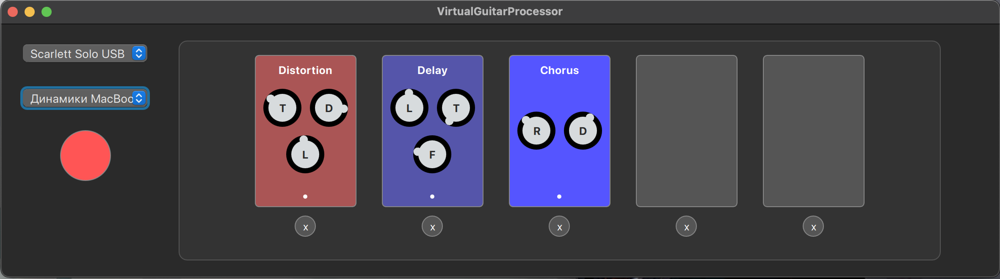

### Virtual Guitar Pedalboard
Virtual Guitar Pedalboard is a simple guitar processor written in C++ that implements a pedal chain with real-time audio processing.

The project was created for educational and recreational purposes.

It provides both a basic CLI interface and a full-featured UI written in Qt/QML. The core project is independent of Qt.

Up to 5 pedals can be placed in the processing chain.
Currently implemented pedals are: Distortion, Delay and Chorus.



## Audio Devices
PortAudio is used to work with audio devices.
Audio backend support is implemented as a plugin, which makes it possible to add alternative libraries (for example, ALSA) or multiple backends if needed.

## Build
The project is built using CMake.
```
cmake -B build
cmake --build build -j
```

## Run
Using the CLI
```
./build/vgp path/to/plugins/dir
```

Using the UI (Qt / QML)

```
./build/ui/.../vgpUI path/to/plugins/dir
```

P.S. The project is still under development, so not all planned features may work correctly.
